
<h1 align="center">文化遗产的保护与旅游开发+jsp</h1>

## 简介
文化遗产的保护与旅游开发系统：角色分为管理员、用户；提供景点信息浏览、票务购买、文化产品购物、订单管理、用户信息管理等功能，实现旅游资源的有效管理与开发。    --计算机毕业设计源码；毕设源码；java毕业设计源码

## 联系方式

<h3 align="center">获取完整代码与数据库文件 + 微信：deepguan QQ: 86050149 QQ群: 783742310</h3>

<h3 align="center">可帮忙远程部署 包运行成功！提供远程部署、修改代码、设计文档指导、代码讲解等服务！</h3>

## 功能介绍（完整见运行截图）
管理员：提供景点、文化产品、论坛等模块的管理功能，支持添加、编辑和删除景点及文化产品信息，管理员可通过订单管理模块处理景点和文化产品的订单，审核和管理用户注册信息，维护论坛的帖子和回复。  
用户：可浏览和购买文化产品、景点门票，支持通过购物车进行商品数量调整和订单提交，用户可以管理个人信息，查看和修改收货地址、景点收藏，并在个人中心查看历史订单及余额，用户还可以参与论坛交流，与其他用户互动交流。

## 运行截图
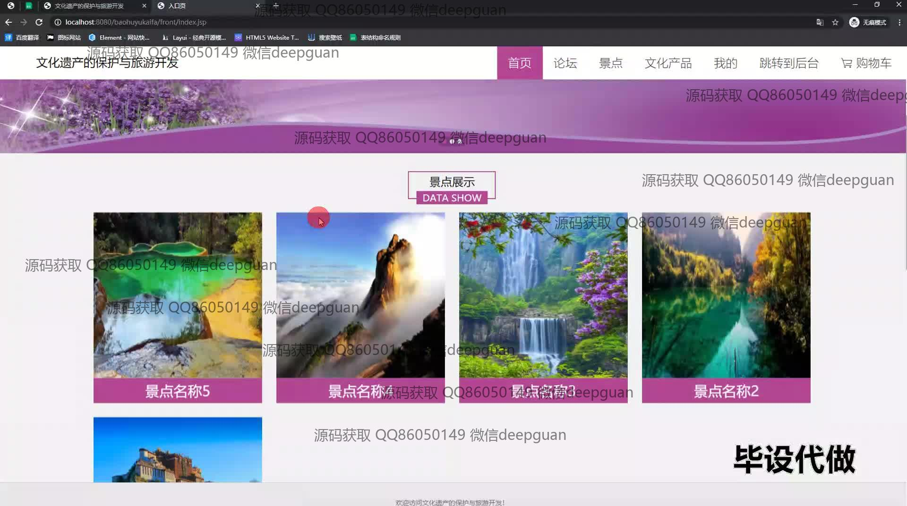
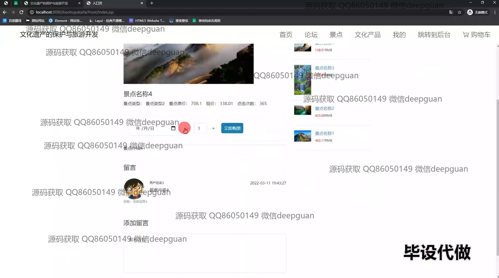

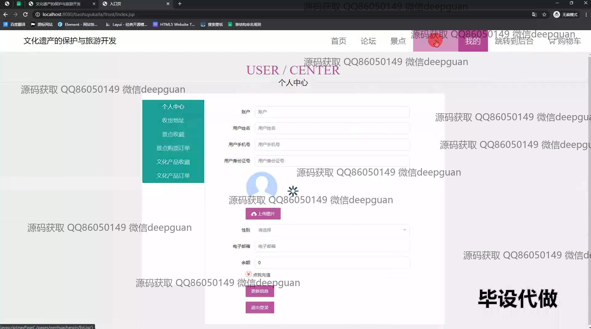
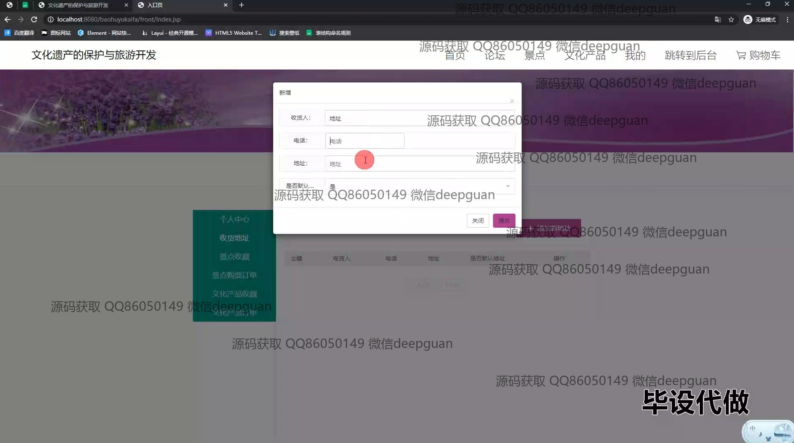
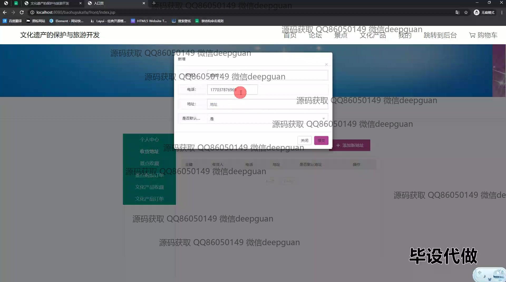

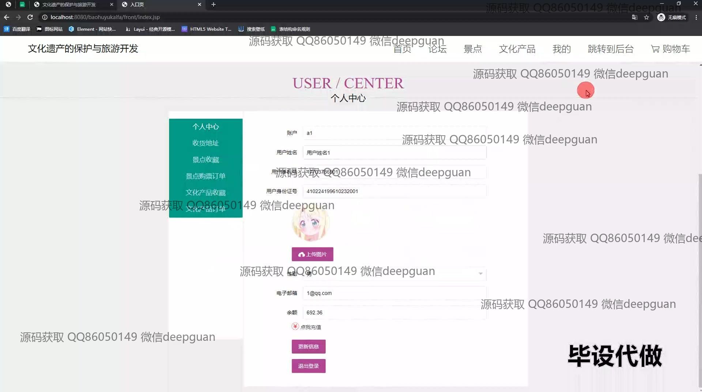
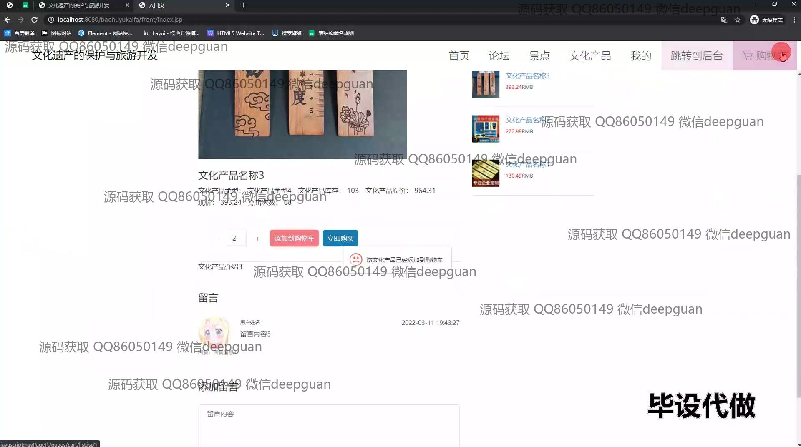
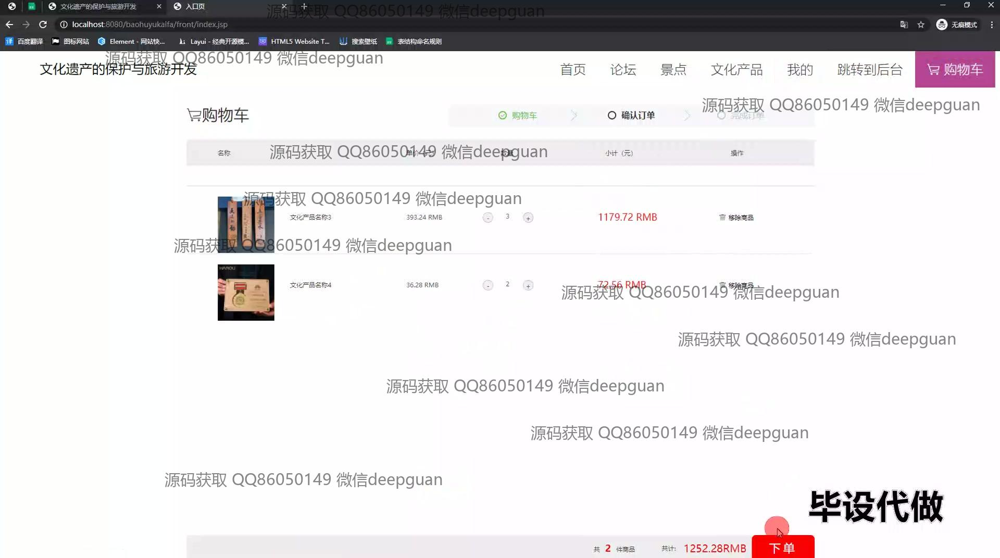
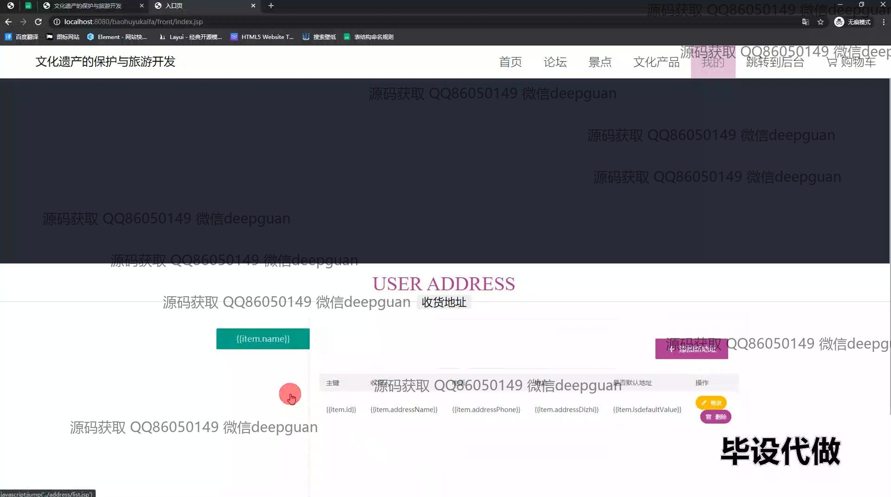
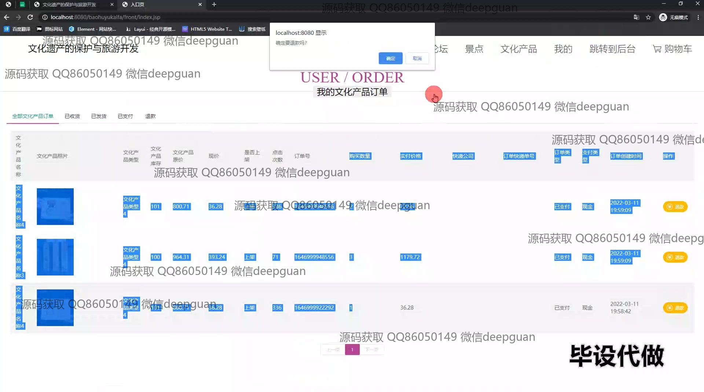
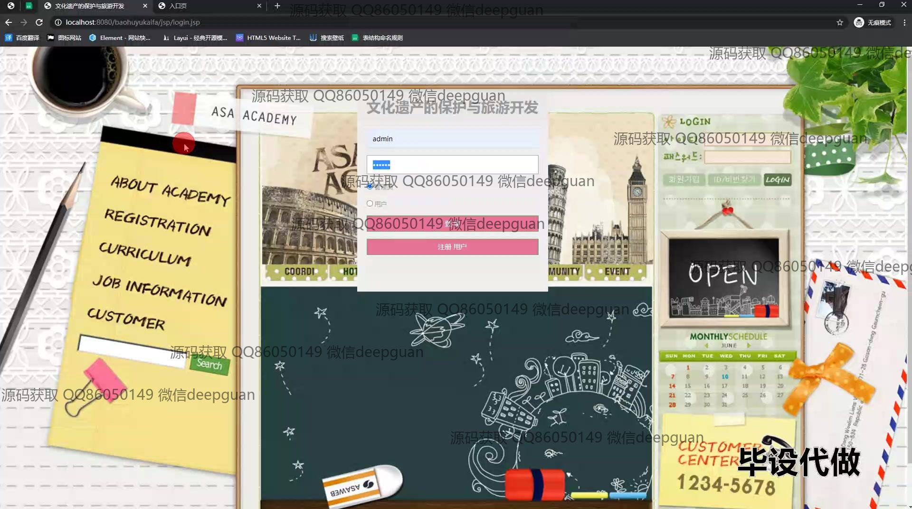
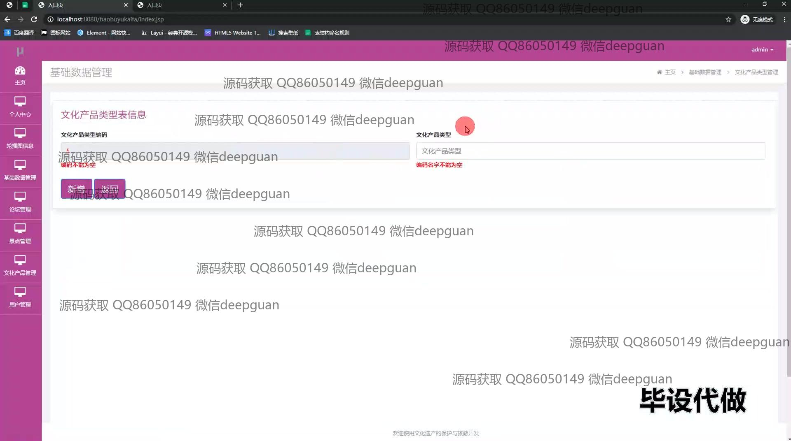
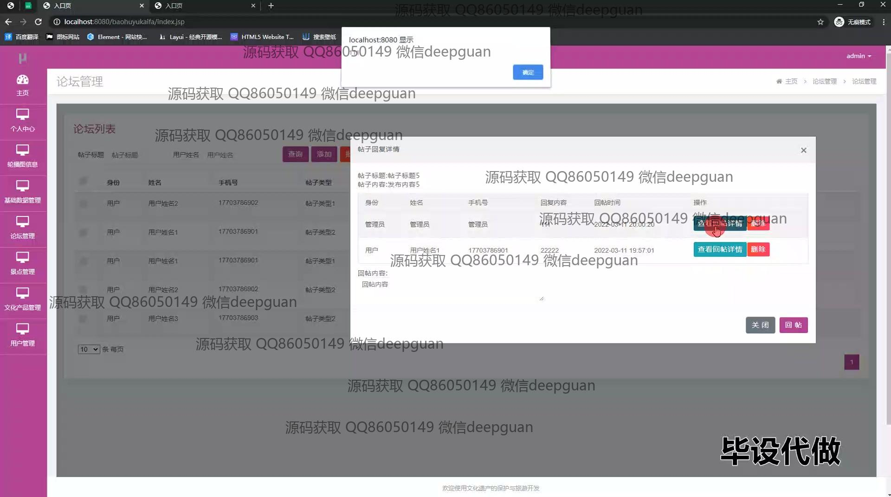
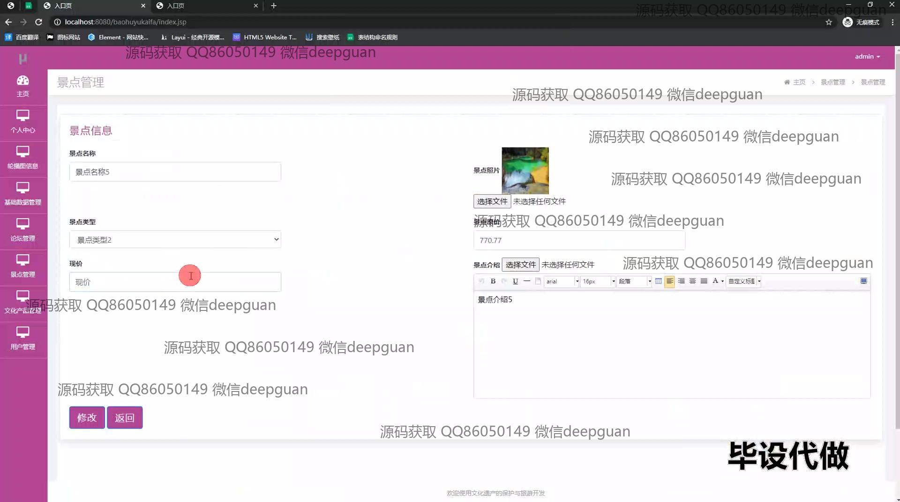
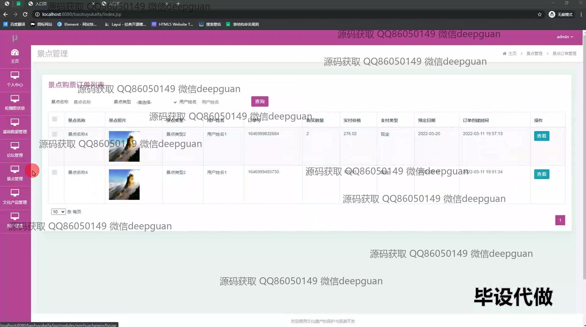
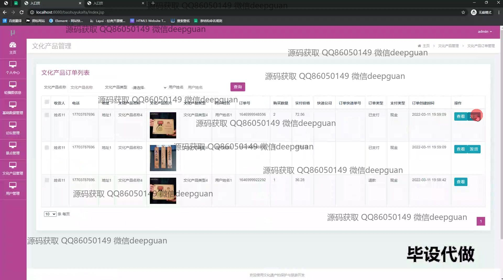
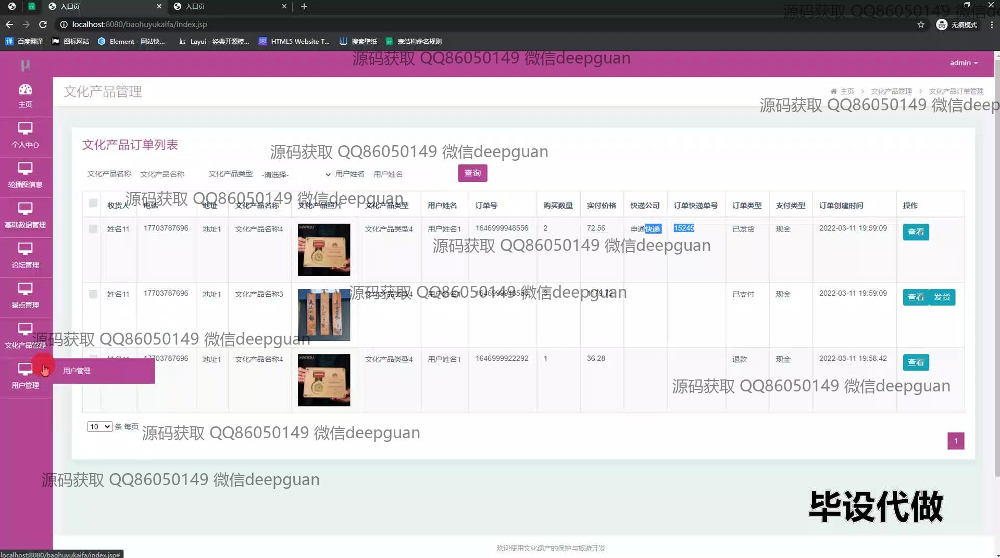
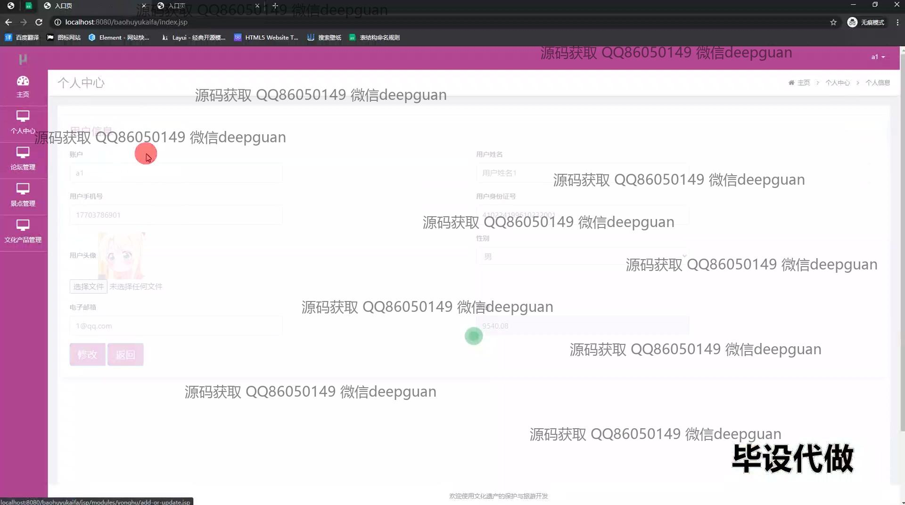
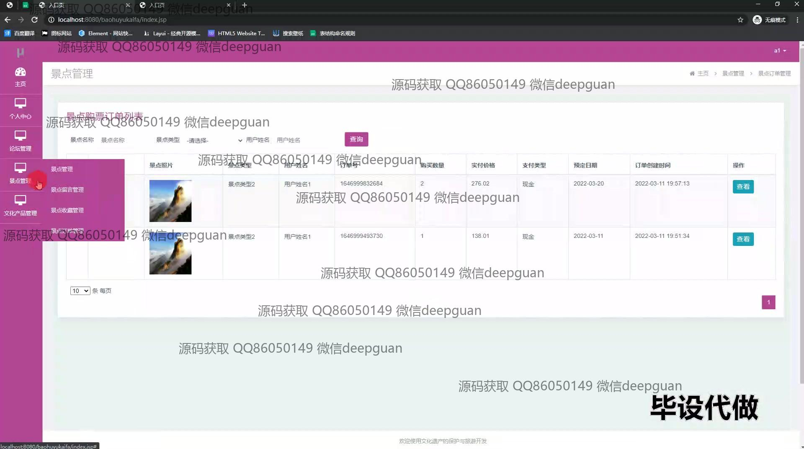

本代码来源于网络,仅供学习参考使用!

